# Gartner

- 미국의 정보 및 기술 자문 회사
- 보고서와 자문 서비스를 판매
- Hype Cycle(솔루션)을 제공하여 시장의 기대 값 예측
 

# 삼성 SDS

- 삼성 그룹의 ICT 기업
- 솔루션 & 플랫폼 & IT 서비스 제공
- 매년 IT 기술 트렌드를 제공하여, 현재 삼성에서 주목하고 있는 기술을 소개
 

# Strategic Technology Trends

- Gartner Top 10 Strategic Technology Trends (2012)

  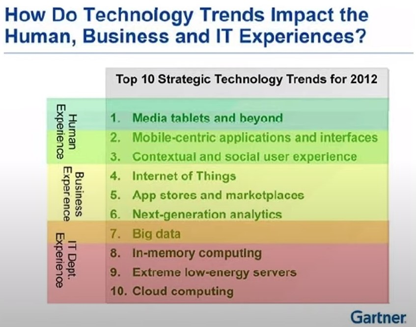

- Gartner Top 10 Strategic Technology Trends (2013)

  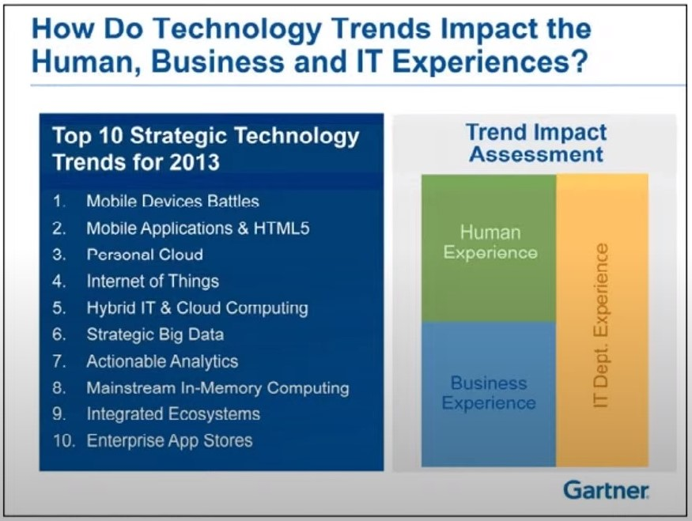

- Gartner Top 10 Strategic Technology Trends (2014)

  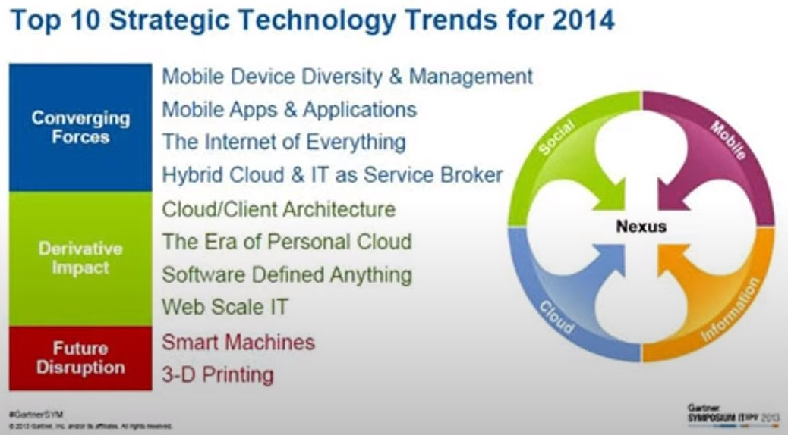

- Gartner Top 10 Strategic Technology Trends (2015)

  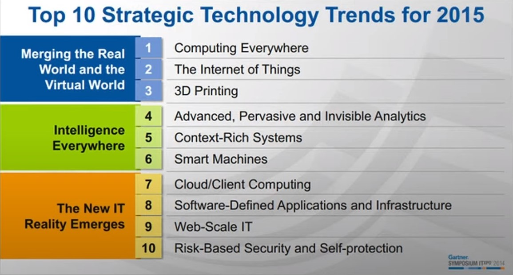

- Gartner Top 10 Strategic Technology Trends (2016)

  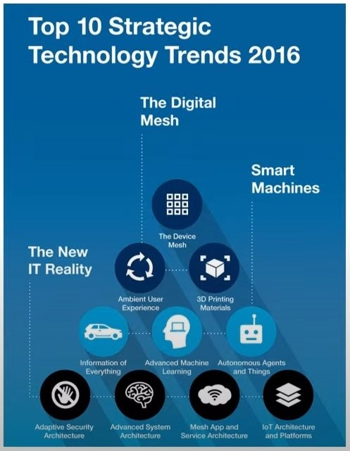

- Gartner Top 10 Strategic Technology Trends (2017)

  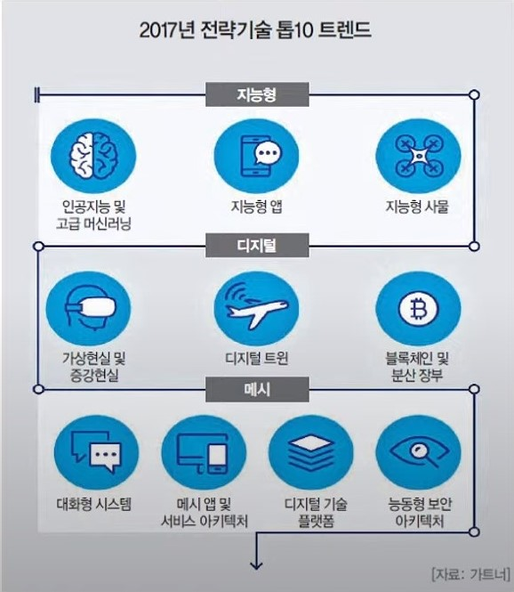

- Gartner Top 10 Strategic Technology Trends (2018)

  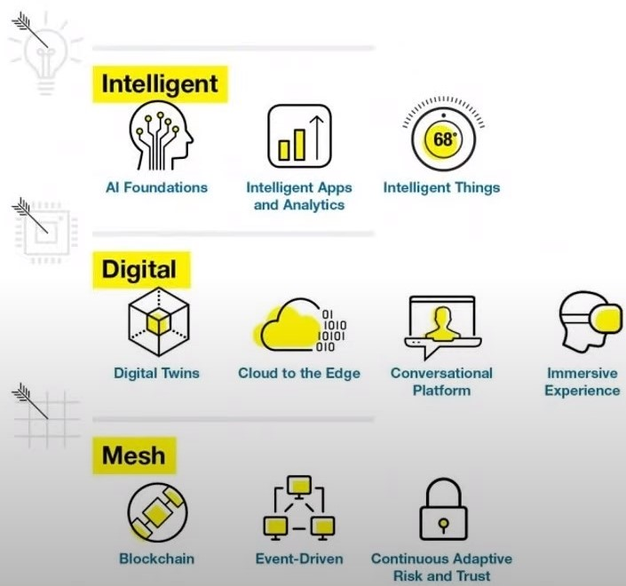

- Gartner Top 10 Strategic Technology Trends (2019)

  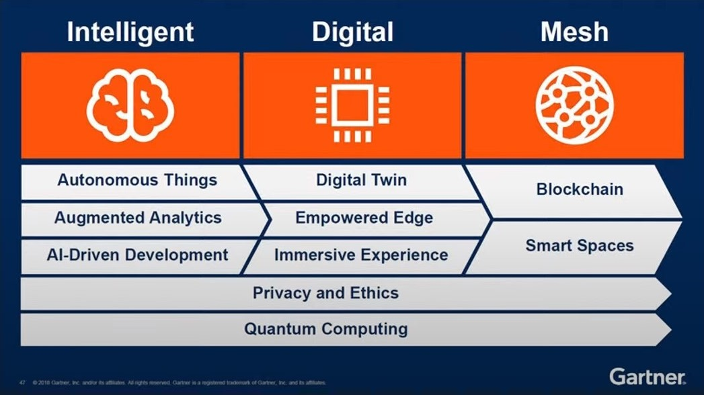

- Gartner Top 10 Strategic Technology Trends (2020)

  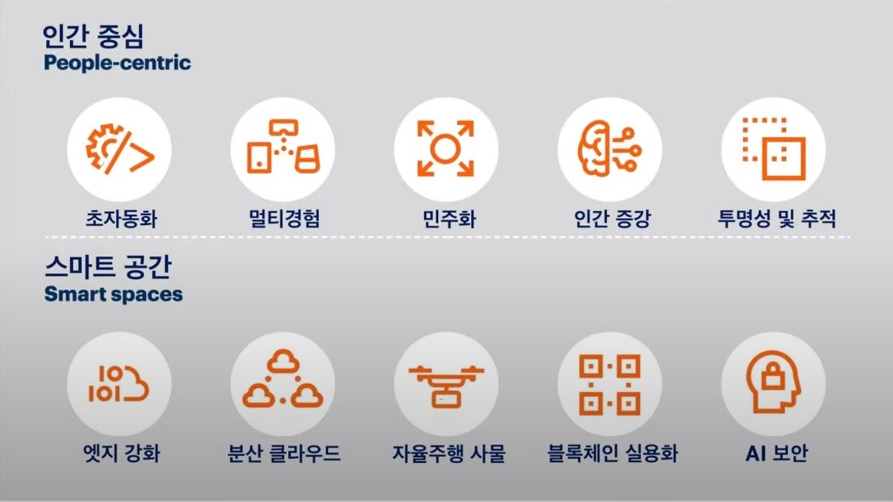

- Gartner Top 10 Strategic Technology Trends (2021)

  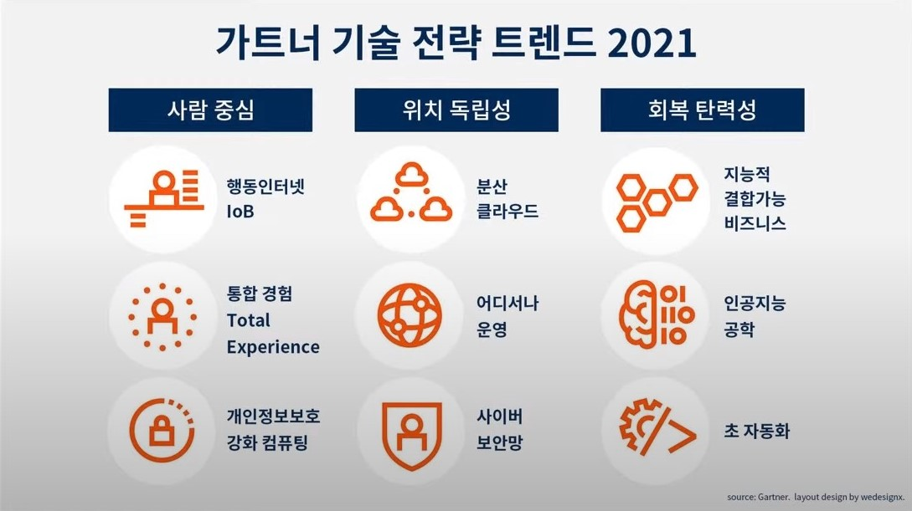

- Gartner Top 10 Strategic Technology Trends (2022)

  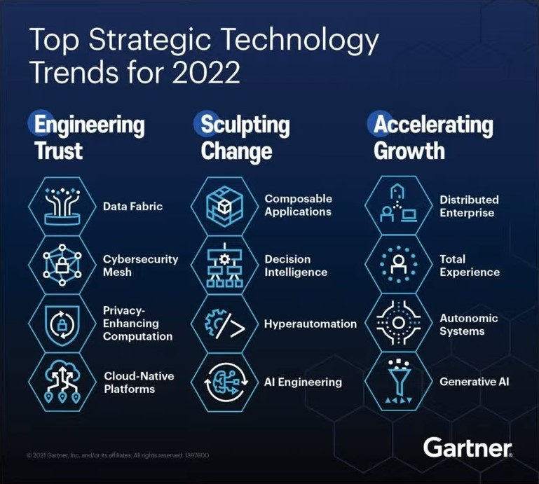

- Gartner Top 10 Strategic Technology Trends (2023)

  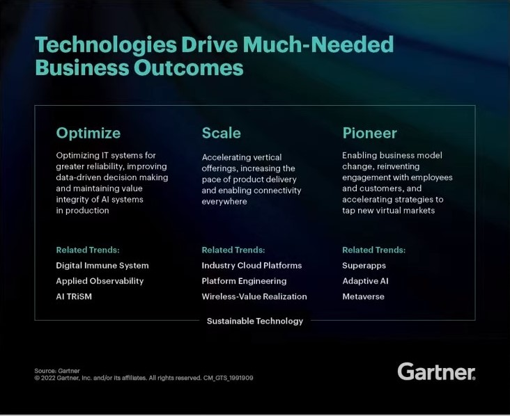
 

# AI 기술 발전이 끼치는 영향

## AI로 대체

- 대체하기 쉬운 분야 : 데이터 분석을 통해 결과를 내는 업무
- 대체하기 어려운 분야 : 몸을 쓰는 업무, 사회적 관계와 연관된 직종
- 창의력이 필요한 분야도 AI로 대체될 수 있다.
