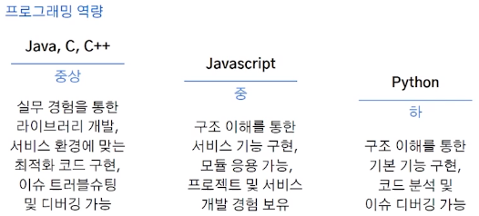
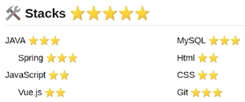
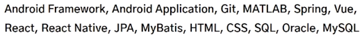
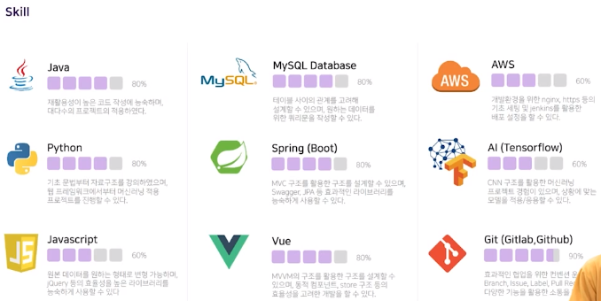

# 포트폴리오는 면접관과 라포를 쌓는 과정

- 면접관은 지원자의 포트폴리오를 읽으면서 자연스럽게 라포를 쌓는다.
- 포트폴리오는 단순한 서류가 아니라 나라는 사람과 내 프로젝트를 면접관에세 익숙하게 만들어주는 문서
- 면접장에서 모든 것을 완벽하게 설명할 수는 없다.
 

# 한 줄 자기소개

- 면접관의 도적의식을 불러 일으키는 자기소개는 지양
  - ex) "TDD를 실천하는 개발자", "객체지향을 추구하는 개발자", "Agile을 생활화하는 개발자", "Clean Code를 작성하는 개발자"
  - 실제로 그렇게 했는지 검증해본다.
   

# 면접관의 시간과 인내심은 유한하다

- 면접관들은 시간에 쫓기는 사람들
- 면접도 봐야하고 현업 업무들도 해야하고..
- 중요한 정보일수록 상단에 쓴다.
- 한 줄 자기소개 / Github 주소 / Notion / 기술 블로그 / 기술 스택
 

# 기술 스택

- 상 / 중 / 하

  

- ⭐⭐⭐⭐⭐ 별점

  

- 나열

  

- % 및 설명

  
 

# 모든 키워드에 대해 3-depth 사전 질문

- 작성된 프로젝트 경험을 토대로 면접관의 예상 질문을 준비한다.
 

# 살아있는 포트폴리오는 적어도 1개 이상

- 다양한 입력에 대한 예외처리는 되어 있는지
- 디버거를 열었을 때 알 수 있는 수많은 것들(에러, 압축, 난독화, 최적화)
 

# 작성 방법

- 프로젝트 개요, 사용 기술, 수행 역할, Sales Point 중심으로 정리
 

# 2022.11.29 - 포트폴리오 발표회 후 느낀점

## 추가할 내용

- 입상 내역, 기술스택과 선정 이유
- Agile 기반의 프로젝트를 했다는 기록(Gitlab, JIRA 등)
- 기여한 부분 - 성능 개선, 적용한 알고리즘 등
- 아쉬웠지만 극복한 내용

## 수정할 내용

- 한 줄 소개
- 내가 한 일
- Skill

## 참고해 볼 만한 내용

- 프로젝트 우선 순위 선정 방법
  - 지원하는 기업에 맞게 선정
  - 기술적으로 많은 어필이 가능한 순서로 선정
  - 프로젝트 진행 시기에 따라 선정 (최신순 또는 오래된 순)
- 가시성을 고려한 폰트 선정
- 2-Depth로 구성
- 스터디 진행 경험
- 노션에 정리할 경우 프로젝트를 Card or Gallery 형식으로 정리
